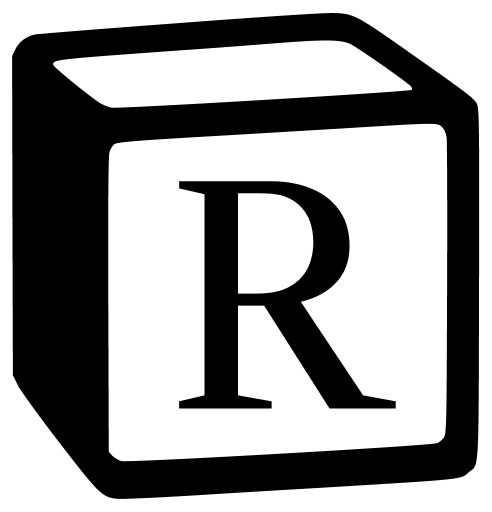
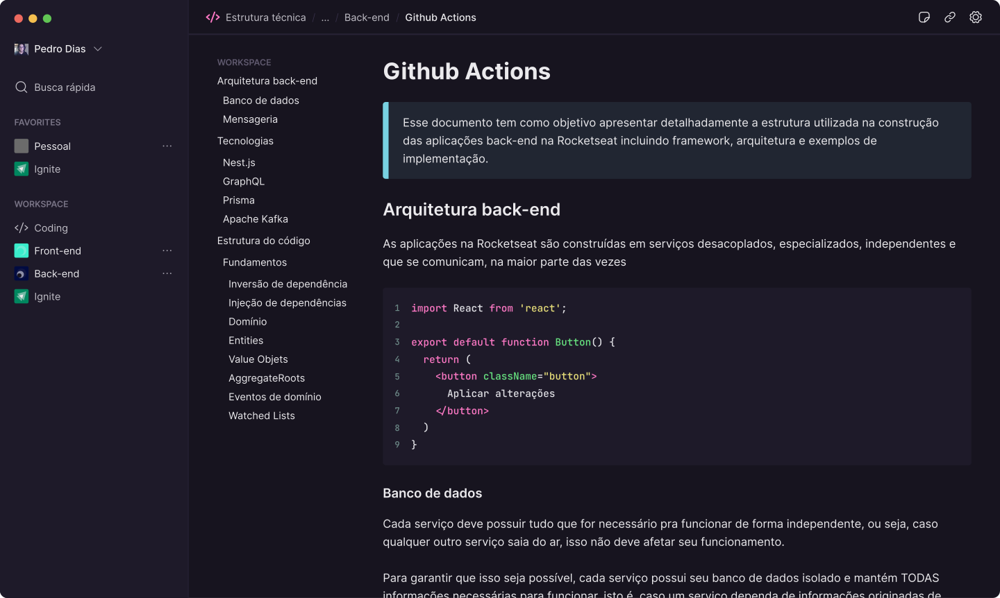
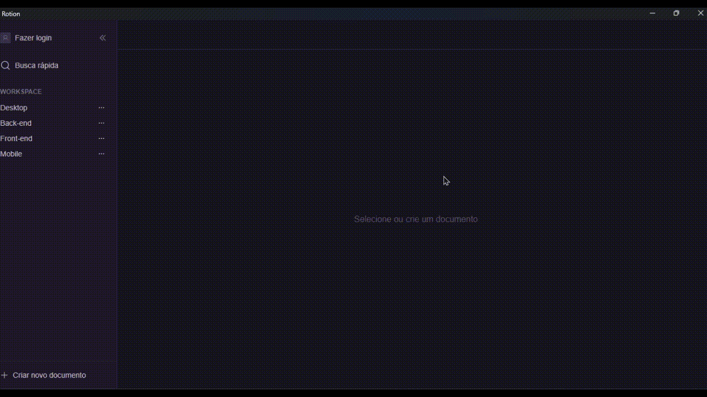

<h1 align="center">
  
</h1> 

## 📄 Sobre
Projeto baseado no Notion, utilizando os melhores conceitos do Electron, tais como camadas como Renderer, Main, IPC, Preload e outros.

<br>

<div align="center">
  
</div> 

<br>

<div align="center">
  
</div> 

</br>

## 🚀 Como executar

Clone o projeto e acesse a pasta

```bash
$ git clone https://github.com/luc-ribeiro/rotion-electron.git
$ cd 
```

### Instalando

```bash
$ npm install
```

### Executando

```bash
$ npm run dev
```

</br>

A aplicação estará disponível no endereço `http://localhost:5173`

<br>

## 💻 Tecnologias

- Electron
- React
- TypeScript
- TailwindCSS
- Vite

</br>

## 🔖 Layout
- [Rotion - Figma](https://www.figma.com/file/KjSfGrN1Dk6lAoCQ1NmUkk/Rotion-(Curso-de-Electron)-(Copy)?type=design&mode=design&t=gNIkFojFzAQYlXNz-1)

<br></br>
